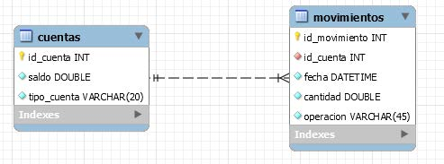
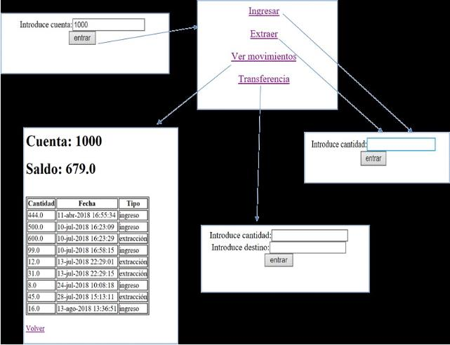

# AI-4. Cajero virtual Spring Boot JPA

## Enunciado

Realizar la implementación de un cajero virtual, aplicando el patrón MVC con Spring Boot con capa de persistencia para acceso a los datos con Spring Data JPA.
Para la realización de la práctica se empleará una base de datos con dos tablas: la tabla de cuentas, que almacena las cuentas del banco; y movimientos, que registra todos los movimientos realizados en cada cuenta.
La estructura de ambas tablas se muestra en la siguiente imagen:

Enlace a script: 

Antes de empezar insertar varias cuentas en la tabla.

El aspecto de las páginas de la aplicación será similar al que se muestra en la siguiente imagen:

Al iniciarse la aplicación se solicitará el número de cuenta con la que se quiere operar, y la cuenta se guardará en un atributo de sesión. Tras validar la misma:

- Si la cuenta no existe no se le deja seguir adelante, y se mostrará el mensaje “Cuenta no existe".
- Si la cuenta existe, aparece un menú con las opciones que se pueden realizar desde el cajero, añadir cerrar sesión.

Al seleccionar Ingresar o Extraer, se nos solicitará la cantidad y la operación quedará reflejada en la tabla de movimientos (Abono, Cargo), además de actualizar el saldo de la cuenta, en la tabla de Cuentas.
Si al extraer dinero, el saldo da negativo impedir que se saque esa cantidad, con el mensaje, “saldo insuficiente”.

Con la opción de Transferencia, se solicitará la cuenta destino y la cantidad a transferir(si tengo saldo, informar con un mensaje).
Si la cuenta no existe, mensaje “Cuenta de destino no existe”.

En esta operación, se registrará un movimiento de extracción en la cuenta origen (cargo por transferencia) y uno de ingreso en la de destino (abono por transferencia), además de almacenar los saldos de ambas cuentas.

Finalmente, la operación Ver movimientos, nos mostrará una página con la lista de movimientos realizados sobre la cuenta, además de mostrar el saldo de la misma.

Comentar el código.

## Formato de Entrega

El nombre del proyecto será: UF4_Cajero_XXX, siendo XXX las siglas de tu nombre y apellidos.

Se entregará un zip del proyecto.
